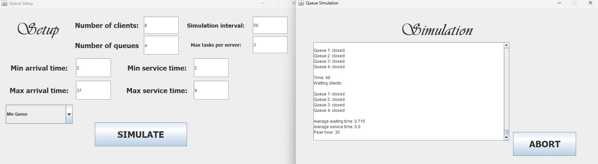

# Queue Management App Simulation



## Objective
The main objective of this work is to propose, design, and implement a queue management app simulation. The app is designed to read input from the user using an interface, process it, and launch multiple threads, each representing a queue. These queues are managed by a manager, which is another thread responsible for optimizing load distribution across all available servers (queues).

In real-world scenarios, servers are expensive to create and maintain, so it is desirable to make the most out of the available resources. A queue management app aims to process a number of clients using parallelized threads, significantly improving the waiting time for each individual client.

### Secondary Objectives
- Use basic principles of Object-Oriented Programming, including abstraction, encapsulation, inheritance, and polymorphism.
- Utilize the "ArrayBlockingQueue" Collection for storing clients waiting to be served by a server.
- Implement Atomic data types for synchronization.
- Use locks with "synchronized", wait(), and notify() calls for inter-thread communication.
- Create a user interface using Java Swing.

## Problem Analysis, Modeling, Scenarios, Use Cases
A queue is modeled by a server object, which serves clients one by one. The scheduler assigns clients to each queue until there are no more to assign. User input must be integer values for the required simulation parameters, synchronized via the use of BlockingQueue collection and locks as per assignment requirements.

The input data generates random clients, assigning them to each running server. The simulation results are displayed in logs and the simulation window frame.

- A queue is represented by a server object using the BlockingQueue collection, necessitating synchronization to avoid data corruption.
- Each server is launched by a scheduler, which decides based on a selection strategy (e.g., minimum length or minimum waiting time) where to distribute each client.
- The simulation manager stores simulation parameters, generates random clients, and launches the scheduler and servers on parallel threads.
- Results are updated and displayed in real-time in the user interface and written into an output log file.
- The simulation manager's internal clock generates 1-second pulses transmitted to each running server to enable execution.

## Learnings
The ability to execute code in parallel is exceptionally useful for handling lengthy or infinite loops efficiently. Parallelization, coupled with queue distribution, significantly reduces the average waiting time for clients, leveraging the available hardware resources more effectively.

## Usage

To run the application, simply execute the `App` class. Ensure you have Java installed on your system.

## Cloning Instructions

To clone this repository, run the following command in your terminal:

```bash
git clone https://github.com/AndreiE91/Queues-Management-App.git
```
